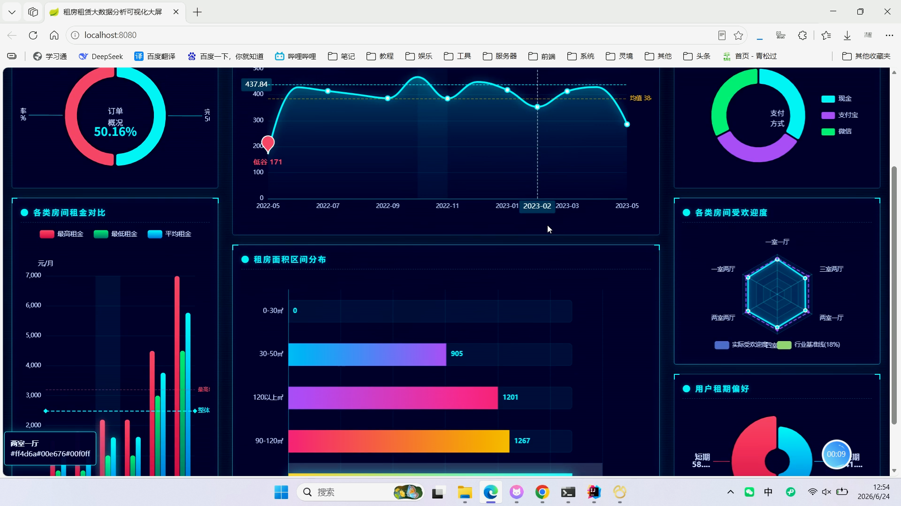
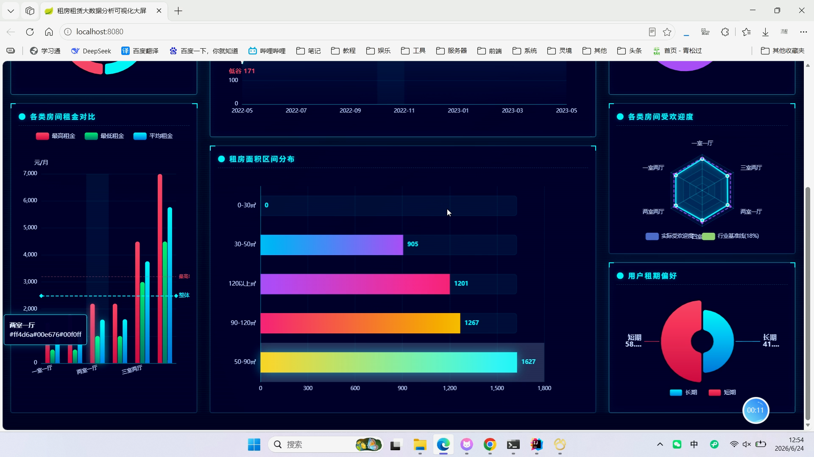
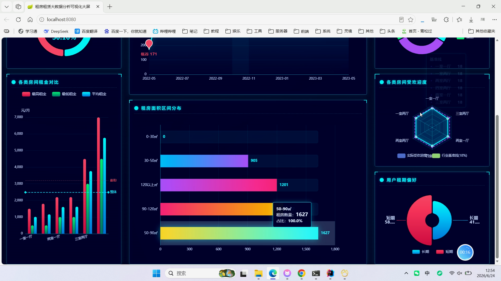
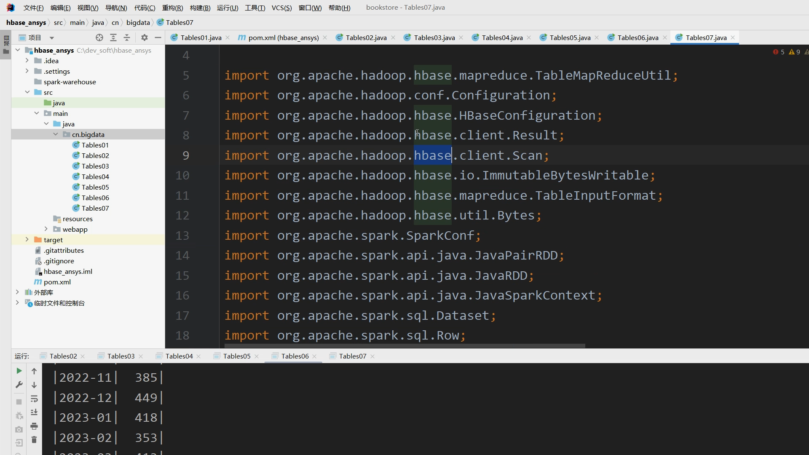
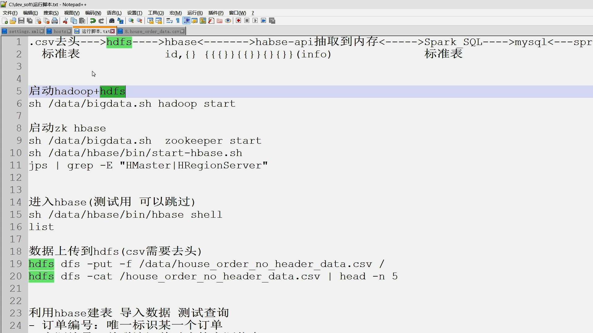
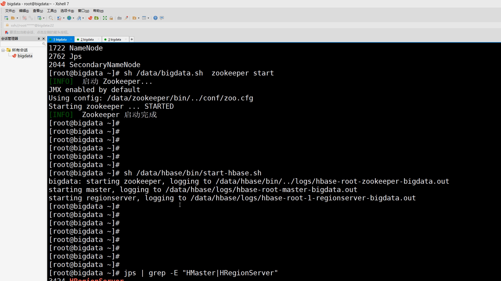
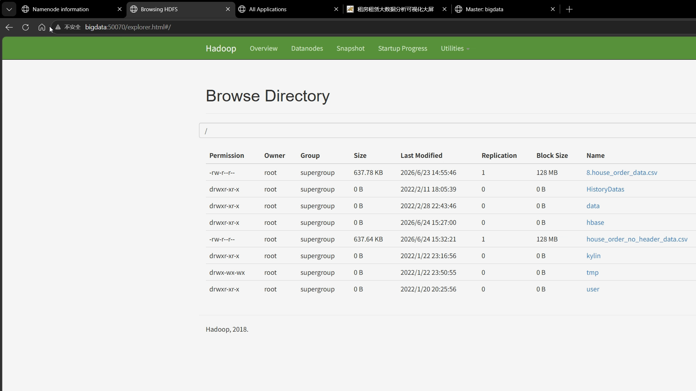
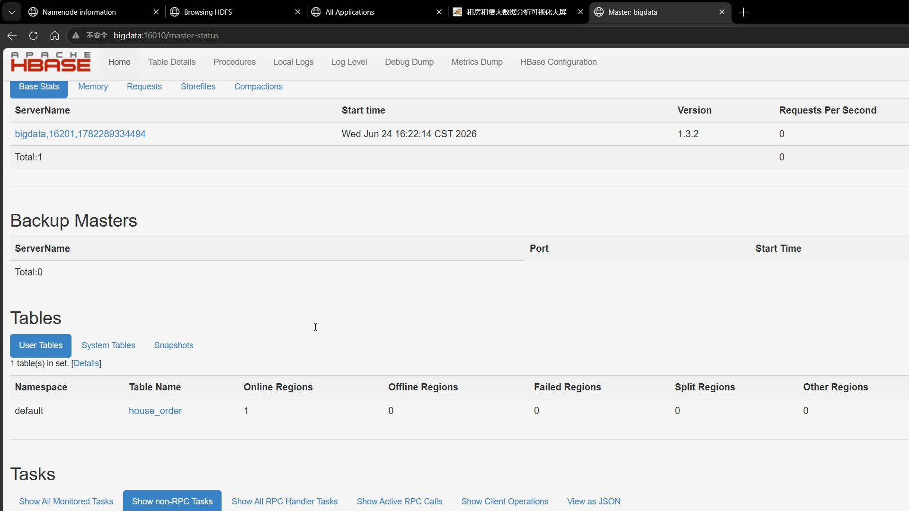

## 计算机毕业设计hadoop+hbase+spark租房大数据分析可视化 租房推荐系统(源码+LW+PPT+讲解)

## 要求
### 源码有偿！一套(论文 PPT 源码+sql脚本+教程)

### 
### 加好友前帮忙start一下，并备注github有偿hbase
### 我的QQ号是2827724252或者微信:code520888 或者 bysj2023nb

# 

### 加qq好友说明（被部分 网友整得心力交瘁）：
    1.加好友务必按照格式备注
    2.避免浪费各自的时间！
    3.当“客服”不容易，repo 主是体面人，不爆粗，性格好，文明人。
## 开发技术：
Bootstrap, HTML5,  JavaScript,  JQuery,  CSS, Servlet, JSP,Hadoop, Hbase,Echars等
## 功能
分析订单完成率 Tables01
分析各类房间租金的最大值、最小值、平均值 Tables02
分析各类房间的受欢迎度(订房数/总数) Tables03 
分析用户偏好的租期：租期小于90天的为短期，大于90天为长期 Tables04
分析用户支付方式占比 Tables05
分析每个月的订单数变化(状态：已完成) Tables06
不同面积区间租房数量 Tables07	
	
## 演示视频

https://www.bilibili.com/video/BV1umjR6mEKF/?spm_id_from=333.1387.homepage.video_card.click

https://www.bilibili.com/video/BV1tmjR62EUK/?spm_id_from=333.1387.homepage.video_card.click

https://www.bilibili.com/video/BV1b2jR67EkM/?spm_id_from=333.1387.homepage.video_card.click

https://www.bilibili.com/video/BV1U2jR67EUK/?spm_id_from=333.1387.homepage.video_card.click

## 运行截图

